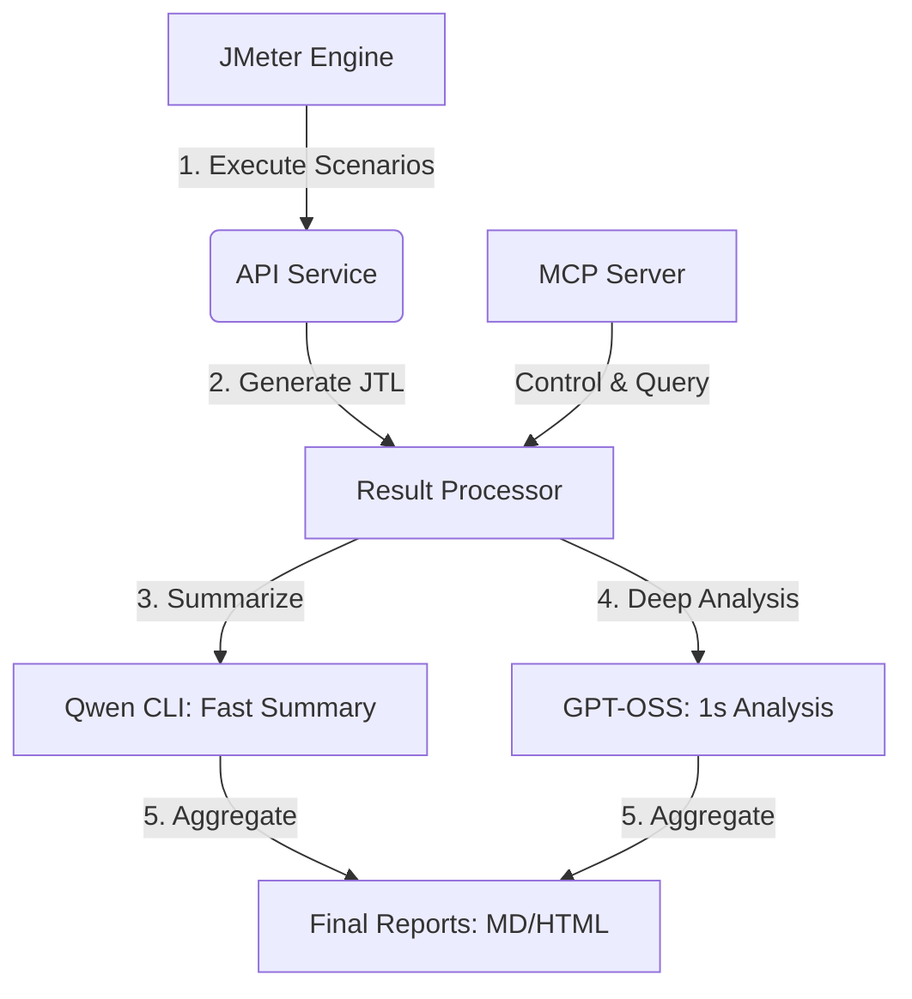

# QA Insights 성능검증 스택

QA Insights 서비스에 맞춰 만든 **JMeter + Qwen CLI + GPT-OSS:120B + MCP** 기반 성능 테스트 자동화 프로젝트입니다.

이 프로젝트의 목적은 단순한 부하 테스트 1회 실행이 아니라, 아래 흐름을 한 번에 만드는 것입니다.

1. JMeter로 API 시나리오 실행
2. `raw.jtl` 저장
3. `summary.json` / `gate.json` 생성
4. 기준선(baseline) 비교
5. Qwen CLI 1차 요약
6. GPT-OSS:120B 심층 분석
7. `llm_report.md`와 `report.html` 생성

---

## 1. 포함된 테스트 시나리오

### 1) `smoke_health`
- 목적: 서버 생존 확인
- 대상: `/health`
- 권장 시점: 서버 띄운 직후, 배포 직후

### 2) `auth_login`
- 목적: 로그인 응답속도와 인증 성공률 확인
- 대상: `/api/auth/login`
- 권장 시점: 인증 변경 후, 세션 이슈 점검 시

### 3) `rag_query`
- 목적: QA Insights 질의응답 API 성능 측정
- 대상: `/api/chat/query`
- 권장 시점: 모델/프롬프트/검색 로직 변경 후

### 4) `e2e_user_journey`
- 목적: 로그인 후 질의까지 이어지는 사용자 흐름 검증
- 대상: 로그인 + 질의응답 연계
- 권장 시점: 릴리즈 전 종합 점검

### 5) `concurrent_overload`
- 목적: 과부하 테스트 및 동시 접속자 대응력 확인
- 대상: 로그인 + 질의응답 동시 부하
- 권장 시점: 대량 접속 예상 전, 용량 산정 전, 병목 지점 확인 시

---

## 2. 권장 실행 순서

### 1단계. 최소 생존 확인
```bash
python run_performance_test.py --plan smoke_health --users 1 --ramp-up 1 --loops 1
```

### 2단계. 로그인 확인
```bash
python run_performance_test.py --plan auth_login --users 5 --ramp-up 5 --loops 1
```

### 3단계. 질의응답 확인
```bash
python run_performance_test.py --plan rag_query --users 5 --ramp-up 5 --loops 1
```

### 4단계. 사용자 흐름 확인
```bash
python run_performance_test.py --plan e2e_user_journey --users 5 --ramp-up 5 --loops 1
```

### 5단계. 과부하/동시 접속자 테스트
```bash
python run_performance_test.py --plan concurrent_overload --users 50 --ramp-up 10 --loops 3
```

### 6단계. 단계적 과부하 테스트 세트
```bash
python run_performance_test.py --plan concurrent_overload --users 20 --ramp-up 10 --loops 2
python run_performance_test.py --plan concurrent_overload --users 50 --ramp-up 10 --loops 3
python run_performance_test.py --plan concurrent_overload --users 100 --ramp-up 20 --loops 3
```

---

## 3. 결과물 위치

실행 결과는 아래 폴더에 생성됩니다.

```text
output/runs/<실행시각>_<플랜명>/
```

주요 파일:
- `raw.jtl` : JMeter 원본 결과
- `html/index.html` : JMeter 시각화 리포트
- `summary.json` : 성능 수치 요약
- `gate.json` : 기준 통과/실패 판정
- `baseline_compare.json` : 기준선 대비 변화량
- `qwen_summary.txt` : Qwen CLI 요약
- `gptoss_analysis.txt` : GPT-OSS 120B 분석
- `llm_report.md` : Markdown 보고서
- `report.html` : 한글 HTML 보고서

---

## 4. 꼭 먼저 수정할 파일

### `config/local.json`
실제 서비스에 맞는 주소와 도구 경로를 여기서 맞춥니다.

예시:
```json
{
  "service": {
    "base_url": "http://127.0.0.1:8000",
    "health_path": "/health",
    "login_path": "/api/auth/login",
    "chat_path": "/api/chat/query"
  },
  "jmeter": {
    "bin": "C:\apache-jmeter-5.6.3\bin\jmeter.bat"
  },
  "qwen": {
    "enabled": true,
    "command": "C:\Users\admin\AppData\Roaming\npm\qwen.cmd"
  },
  "gpt_oss": {
    "enabled": true,
    "base_url": "http://localhost:11434",
    "model": "gpt-oss:120b"
  }
}
```

---

## 5. Qwen CLI 중심 분석 포인트

Qwen CLI는 아래 역할로 쓰는 것을 권장합니다.
- 테스트 결과 핵심 이슈 5개 요약
- 병목 후보 우선순위 정리
- 실패 응답 패턴 분류
- 바로 공유 가능한 한 줄 결론 작성

GPT-OSS:120B는 아래 역할로 쓰는 것을 권장합니다.
- 심층 원인 분석
- 다음 실험 설계
- 병목 원인 가설 정리
- 개발/운영 액션아이템 분리

---

## 6. 추천 테스트 세트

### A. 기본 확인
- `smoke_health`
- `auth_login`
- `rag_query`

### B. 릴리즈 전 점검
- `smoke_health`
- `auth_login`
- `rag_query`
- `e2e_user_journey`
- 기준선 비교 포함

### C. 과부하 점검
```bash
python run_performance_test.py --plan concurrent_overload --users 20 --ramp-up 10 --loops 2
python run_performance_test.py --plan concurrent_overload --users 50 --ramp-up 10 --loops 3
python run_performance_test.py --plan concurrent_overload --users 100 --ramp-up 20 --loops 3
```

해석 기준 예시:
- 20명: 정상 동작 구간 확인
- 50명: 병목 시작 지점 확인
- 100명: 에러율 상승과 p95/p99 악화 여부 확인

---

## 7. MCP 서버

MCP 서버 실행:
```bash
python server.py
```

제공 툴:
- `run_jmeter_test`
- `analyze_jtl`
- `compare_with_baseline`
- `review_with_qwen`
- `review_with_gpt_oss`
- `run_full_qa_pipeline`

한국어 별칭:
- `헬스체크` → `smoke_health`
- `로그인성능` → `auth_login`
- `질의응답성능` → `rag_query`
- `종합흐름` → `e2e_user_journey`
- `과부하테스트` / `동시접속자테스트` → `concurrent_overload`

---

## 8. 빠른 시작

```bash
python run_performance_test.py --plan smoke_health --users 1 --ramp-up 1 --loops 1
```

성공하면 그다음:
```bash
python run_performance_test.py --plan auth_login --users 5 --ramp-up 5 --loops 1
python run_performance_test.py --plan rag_query --users 5 --ramp-up 5 --loops 1
python run_performance_test.py --plan e2e_user_journey --users 5 --ramp-up 5 --loops 1
python run_performance_test.py --plan concurrent_overload --users 20 --ramp-up 10 --loops 2
# 🚀 QA Insights 성능검증 자동화 플랫폼 (Automated Performance Testing Stack)

QA Insights 서비스의 안정성과 성능을 보장하기 위한 **JMeter + Qwen CLI + GPT-OSS:120B + MCP** 기반의 통합 성능 테스트 자동화 프로젝트입니다. 

이 시스템은 단순한 부하 테스트를 넘어, **부하 발생 ➔ 결과 수집 ➔ AI 기반 성능 분석 ➔ 최종 리포트 생성**에 이르는 전체 파이프라인을 자동화하여 테스트 엔지니어의 개입을 최소화하고 의사결정 속도를 극대화합니다.

---

## 🌟 핵심 기능 (Core Value)

1.  **End-to-End 자동화 파이프라인**
    *   **JMeter**를 통한 정밀한 API 시나리오 실행 및 부하 생성.
    *   **Qwen CLI**를 통한 1차 텍록 데이터 및 수치 요약.
    *   **GPT-OSS:120B**를 이용한 심층적인 병목 구간 분석 및 가설 수립.
2.  **지능형 성능 분석**
    *   `summary.json`, `gate.json`을 생성하여 사전 정의된 성능 기준(SLA) 통과 여부를 자동 판정.
    *   Baseline(기준선) 비교를 통해 이전 배포 대비 성능 저하(Regression)를 즉각 감지.
3.  **다차원 리포팅**
    *   기술자를 위한 상세 `jlt`, `JSON` 로그.
    *   관리자를 위한 Markdown 요약 (`llm_report.md`) 및 한글 HTML 대시보드 (`report.html`).
4.  **MCP(Model Context Protocol) 지원**
    *   AI 에이전트가 직접 성능 테스트를 트리거하고 결과를 조회할 수 있는 MCP 서버 제공.

---

## 🛠 시스템 구성도 (Architecture)



---

## 🚀 시작하기 (Getting Started)

### 1. 사전 요구사항 (Prerequisites)
*   **Python 3.10+**
*   **Apache JMeter** (설치 및 `config/local.json` 경로 설정 필수)
*   **LLM API/Local Server** (Ollama 또는 OpenAI 호환 API 서버 - vLLM 등)
*   **Node.js** (Qwen CLI 실행을 위한 환경)

### 2. 환경 설정 (Configuration)
`config/local.json` 파일을 프로젝트 환경에 맞게 수정합니다.

```json
{
  "qwen": {
    "enabled": false,
    "command": "C:\\Users\\admin\\AppData\\Roaming\\npm\\qwen.cmd",
    "timeout_sec": 120
  },
  "gpt_oss": {
    "enabled": true,
    "base_url": "http://localhost:11434",
    "api_key": "EMPTY",
    "model": "gpt-oss:120b",
    "timeout_sec": 300,
    "stream": false,
    "max_prompt_chars": 6000,
    "generation": {
      "temperature": 0.1,
      "num_predict": 220
    }
  },
  "service": {
    "base_url": "http://192.168.0.122:8010",
    "health_path": "/PJTE0000",
    "login_path": "/user/signin",
    "chat_path": "/PJTE3000/select"
  },
  "jmeter": {
    "bin": "C:\\apache-jmeter-5.6.3\\bin\\jmeter.bat",
    "testplan_dir": "jmeter/testplans",
    "data_dir": "jmeter/data",
    "default_users": 10,
    "default_ramp_up": 1,
    "default_loops": 1,
    "default_duration_sec": 10
  },
  "report": {
    "enable_jmeter_dashboard_in_full": false
  }
}
```

### 3. 테스트 실행 (Execution)

#### **[모드 1] Quick Mode (빠른 확인)**
가장 핵심적인 수치(Summary, Gate)와 AI 요약만 빠르게 생성합니다.
```bash
python run_performance_test.py --plan smoke_health --users 1 --ramp-up 1 --loops 1
```

#### **[모드 2] Full Mode (심층 분석)**
HTML 대시보드, Baseline 비교, 한글 리포트까지 모든 결과물을 생성합니다.
```bash
python run_performance_test.py --plan concurrent_overload --users 50 --ramp-up 10 --loops 3 --pipeline-mode full
```

---

## 📂 프로젝트 구조 (Project Structure)

| 디렉토리 | 설명 |
| :--- | :--- |
| `jmeter/testplans/` | 실행 가능한 `.jmx` 테스트 시나리오 파일 저장소 |
| `config/` | 서비스 URL, JMeter 경로, LLM 설정 등 핵심 환경 설정 |
| `scripts/` | 파이프라인 실행 로직, 요약 및 리포트 생성 스크립트 |
| `output/runs/` | 실행 결과물 (JTL, JSON, HTML 리포트, AI 분석 로그) |
| `baselines/` | 성능 기준선(Baseline) 데이터 저장 (`.json`) |
| `server.py` | MCP 서버 (AI 에이전트용 인터페이스) |

---

## 📊 결과물 확인 (Outputs)

실행 완료 후 `output/runs/<timestamp>_<plan>/` 폴더에서 다음 파일을 확인할 수 있습니다.

*   📄 **`llm_report.md`**: Qwen과 GPT-OSS가 작성한 텍스트 기반 요약 보고서
*   🌐 **`report.html`**: 프로젝트 전체 결과를 시각화한 한글 웹 리포트
*   📉 **`summary.json`**: TPS, Error Rate, Latency 등 주요 지표 요약
*   ✅ **`gate.json`**: SLA 통과 여부 (PASS/FAIL)
*   🔍 **`baseline_compare.json`**: 이전 테스트 결과와의 성능 차이 분석 데이터

---

## 🤖 AI Agent 활용 (MCP Server)

MCP 서버를 활용하면 Claude나 다른 AI 에이전트가 직접 성능 테스트를 수행하도록 할 수 있습니다.

```bash
# MCP 서버 실행
python server.py
```

**사용 가능한 Tool:**
*   `run_jmeter_test`: 특정 플랜으로 테스트 수행
*   `analyze_jtl`: JTL 로그의 상세 패턴 분석
*   `compare_with_baseline`: 현재 결과와 과거 성능 비교
*   `run_full_qa_pipeline`: 테스트부터 최종 리포트 생성까지 전체 자동화

**한국어 별칭:**
*   `헬스체크` → `smoke_health`
*   `로그인성능` → `auth_login`
*   `질의응답성능` → `rag_query`
*   `종합흐름` → `e2e_user_journey`
*   `과부하테스트` → `concurrent_overload`
